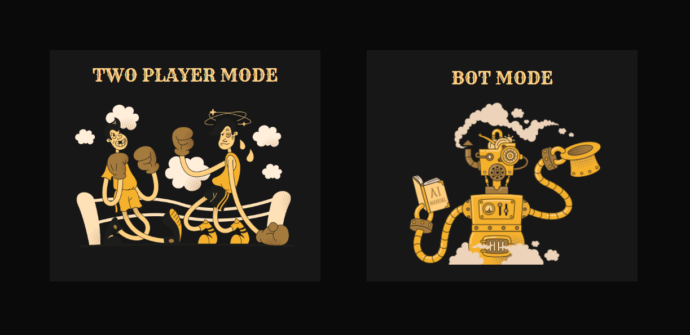

# Tic Tac Toe
Classic Tic Tac Toe game(also called Noughts and Crosses) created using HTML, CSS and Javascript for The Odin Project.

## Features
- Two modes: 
    - TwoPlayerMode
    - BotMode
- Simple Interface
- Beautiful confetti 🎉
- Sound Effects

## Learnings
- Factory Function
- Scope in Javascript
- Closure
- Module Pattern
- IIFE (Immediately Invoked Function Expression)
- How to create private variables and functions 
- How to implement inheritance with factory functions
- Object.assign(): copies all enumerable own properties from one or more source objects to a target object. It returns the modified target object.

## Roadmap
- Add unbeatable AI using the minimax algorithm
- Add levels: easy, medium, hard
- Add dark/light theme toggle

## Preview

## Demo
👉 [Live Demo](https://ruchita1010.github.io/tic-tac-toe)